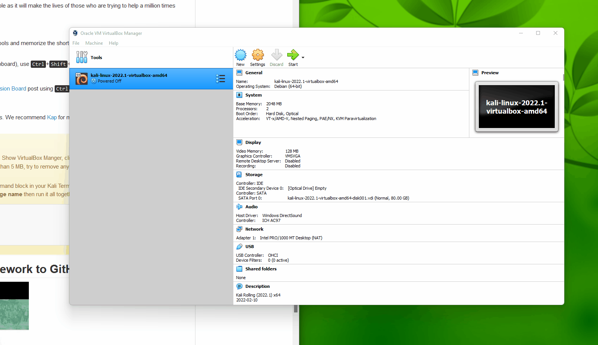
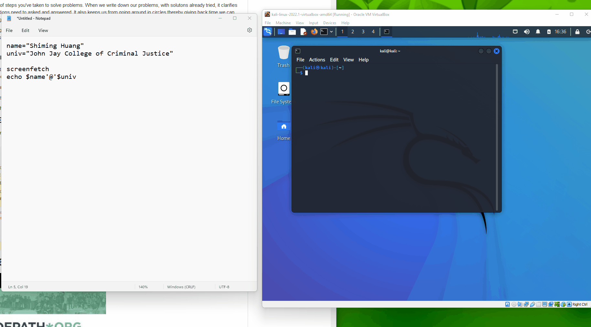

# WordPress

**Unit 7 finding Vulnerabilities**: 


```
name="FirstName LastName"
univ="University of Science"

screenfetch
echo $name'@'$univ
```

Save the file as **screenfetch.gif**.

**Challenges and Problems**: 

### Installing VirtualBox and Kali

 
### Running screenfetch

